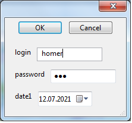
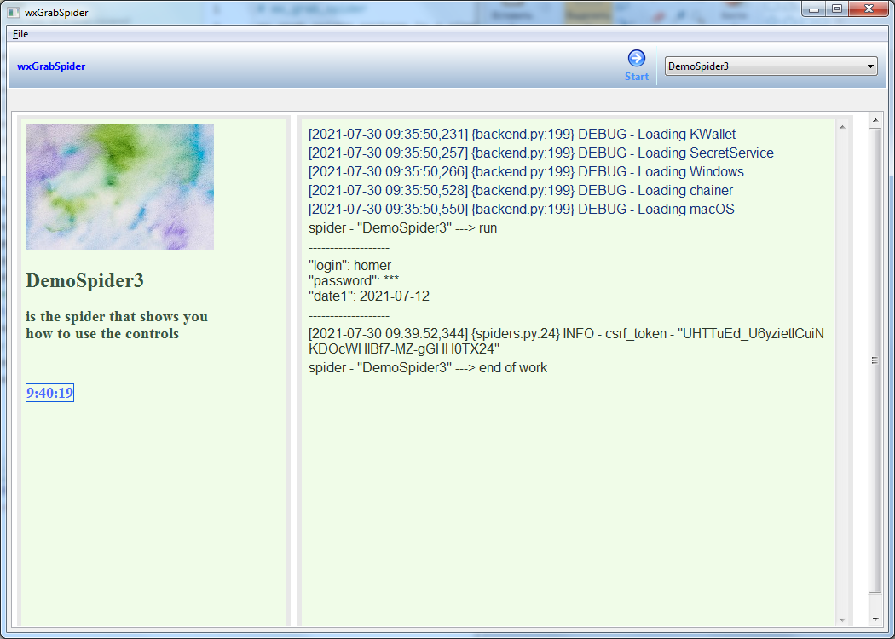

# wx_grab_spider
package is a simple GUI for [Grab:Spider](https://github.com/lorien/grab) with WxPython
wx_grab_spider is handy for building small applications
to automate routine actions on sites related to login, password and so on.
After starting the application, the reference values are saved in the user profile
passwords with [pypref](https://bachiraoun.github.io/pypref/), passwords with [keyring](https://github.com/jaraco/keyring),
logging is used to output the results to the application window

## Usage
This directory is an example of how to run applications with wx_grab_spider.
Use WxSpider in the usual way instead of Spider
to enter script parameters just add wx_controls
<pre><code>class DemoSpider3(WxSpider):
    wx_controls = [
        ProtoControl('login', TextCtrl),
        ProtoControl('password', TextCtrlPassword),
        ProtoControl('date1', wxtype=DatePickerCtrl),
    ]
</pre></code>
we get the values for substitution in the script like this
<pre><code>        password = self.control_by_name("password").value
        login = self.control_by_name("login").value
</pre></code>

### Installing
python setup.py install

## Authors
**Aleksandr Osipov**
aleksandr.osipov@zoho.eu
